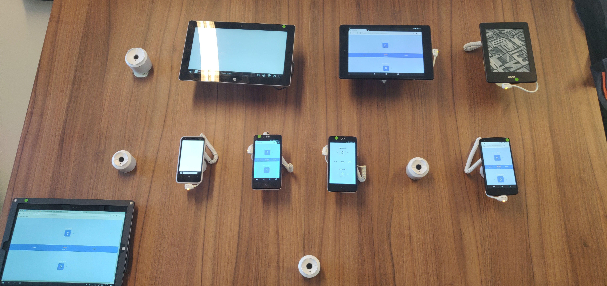
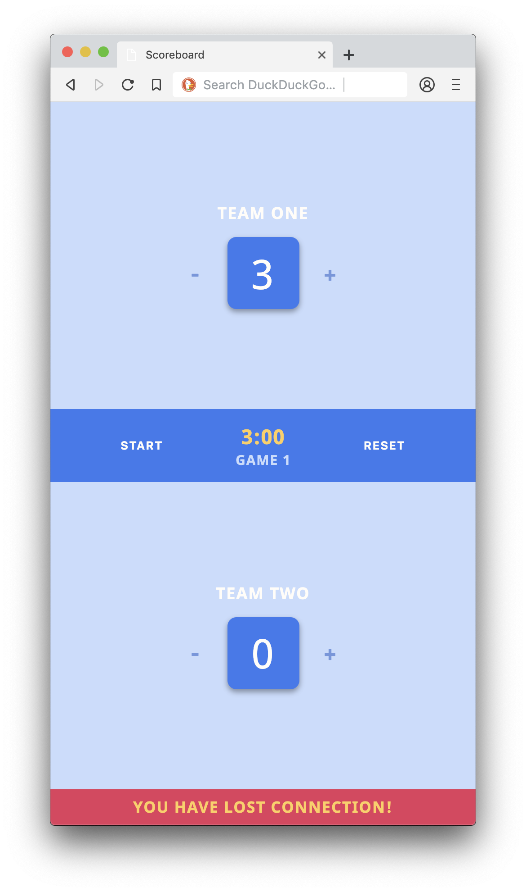

<div align="center">
	<h1 align='center'>Scoreboard App</h1>
	
</div>
<p align="center">
	Keep the score during a practice game, e.g. football or field hockey.
	<br>
	<a href="https://rocky-beach-47665.herokuapp.com/">Live demo</a>
</p>
<br>

## Table of contents

- [Install](#install)
- [Concept](#concept)
- [Progressive enhancement](#progressive-enhacement)
- [Feature detection](#feature-detection)
- [Status](#status)
- [Sources](#sources)

## Install

You have to need [Node.js](https://nodejs.org/en/download/) installed on your computer to run this project. To install this project on your computer, please follow the steps below from your command line:

```shell
# Clone repository
git clone https://github.com/peppequint/browser-technologies-1819.git

# Go to the repository
cd browser-technologies-1819

# Install dependencies
npm install

# Server + file changes are detected
npm run dev
```

## Concept

With this app you can keep track of the score during a training match. Also it is possible to keep track of multiple matches during a training session.

### Core functionality

Keep track of the score during a training match, even when the user can't connect to the internet.

### Device lab

]

## Progressive enhacement

### Javascript disabled

Because the application is rendered server-side, it is possible to use the application when Javascript is off. Every time a goal is scored, the user presses the plus button. This number is sent to the server and will be rendered on the page.

```javascript
// When team one scores a goal
app.post("/homescoreplus", (req, res) => {
  scoreHome++;
  console.log("Score team 1 | " + scoreHome + " punten.");
  res.render("pages/index", { scoreHome: scoreHome, scoreAway: scoreAway });
});
```

With the `POST` method and `submit` button the code above will be called. This applies to every button that has to do with the score.

```html
<!---->
<form class="counter counter-home" action="/homescoreminus" method="POST">
  <button class="counter-btn counter-minus" type="submit">-</button>
</form>
```

### Use offline

When the user goes offline (e.g. bad internet or the user has internet turned off), the application can still be used. The user gets a notification that he is not connected.

```javascript
window.addEventListener("offline", event => {
  // Detects when a user is offline
});
```

When the user is back online, a get request goes to the server. This will update the score when it is adjusted offline. This allows the user to continue at any time, even if he has no internet.

```javascript
window.addEventListener("online", event => {
  // Detects when a user is online
  get("/", {
    homeScore: homeScore.textContent,
    awayScore: awayScore.textContent
  });
});
```

<details><summary><a>Notification</a>
</summary>
<br>

<br>
</details>

## Feature detection

### localStorage

```javascript
// Detects if the browser supports localStorage
if (window.localStorage) {
  localStorage.setItem("Score team 1", homeScoreNumber);
}
```

### Fallback font

```css
/* When custom fonts won't be supported, sans-serif will be activated */
body {
  font-family: "Noto Sans", sans-serif;
}
```

### Fallback css declaration

```css
/* When the value of viewport-height won't be supported, it will be set to pixels */
.container .container-item {
  height: 365px;
  height: 42.5vh;
}
```

## Status

- [ ] Timer needs to be improved.
- [ ] Possibility to add a new game when the first one is over.
- [ ] More feature detection.
