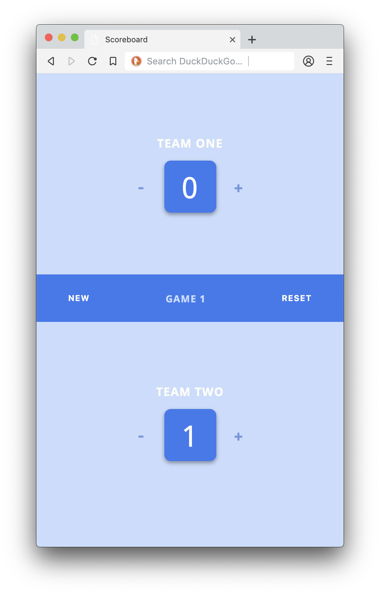

<div align="center">
	<h1 align='center'>Scoreboard App</h1>

</div>
<p align="center">
	Keep the score during a practice game and collect multiple data of your team.
	<br>
	<a href="#">Live demo</a>
</p>
<br>

## Table of contents

- [Install](#install)
- [Concept](#concept)
- [Features](#features)
- [Status](#status)
- [Sources](#sources)

## Install

You have to need [Node.js](https://nodejs.org/en/download/) installed on your computer to run this project. To install this project on your computer, please follow the steps below from your command line:

```shell
# Clone repository
git clone https://github.com/peppequint/browser-technologies-1819.git

# Go to the repository
cd browser-technologies-1819

# Install dependencies
npm install

# Run & build
## what to do here?

```

## Concept

With this app you can keep track of the score during a training match. It is possible to add teams with specific players. This allows the coach to see how well a player performs within the team or to see what the best team is for upcoming fixtures.

### Core functionality

Keep track of the score during a training match.

### Wireflow

## Features

### Progressive enhancement

## Status

## Sources
