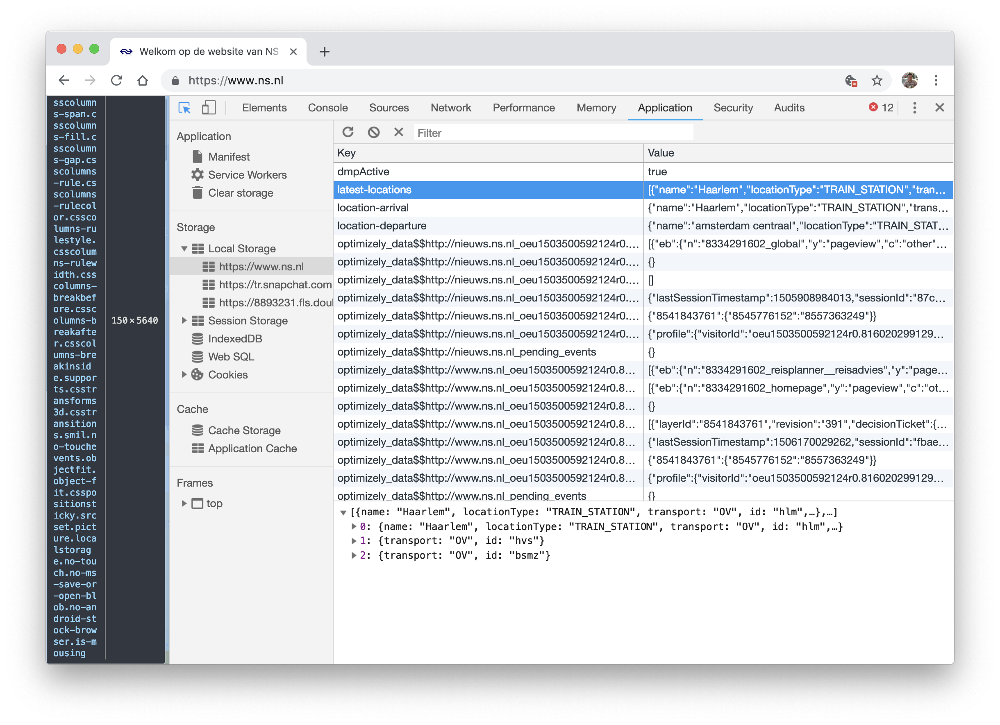

<p align="center">
	<h1 align="center">Browser Technologies</h1>
	
</p>
<p align="center" width="480">
	For this assignment I've done some research about two features of the web; colour and local storage. Below you can find the results of this research.
</p>
<br>

## Table of contents

- [Colour](#Colour)
- [Local storage](#local-storage)
- [Sources](#sources)

## Colour

Colour is one of the most important features on the web. It can make or break a website, doesn't matter what kind of user you are trying to reach.
However, colour is also one of the most difficult features of the web; look at the example below.

<details><summary><a>Contrast</a>
</summary>
<br>

<br>
<blockquote>https://medium.com/@phabbs/dont-suck-at-design-b506abd99f2</blockquote>
</details>

People with vision problems does have a lot of trouble if a website doesn't have a good colour scheme.
But what happens if you only have a greyscale on a website? If the colours are turned off? How does it function?

What I did to test this, I added a few lines of CSS to the universal selector of the stylesheet.

```CSS
* {
  -moz-filter: grayscale(100%);
  -webkit-filter: grayscale(100%);
  filter: grayscale(100%);
}
```

### Examples

For Google Maps colours are very important. The whole map is based on standard colours to highlight different parts. When you 'turn off' the colours and everything is based on a greyscale, the map becomes totally different. All the different aspects look the same and it is not possible to see any difference.

<details><summary><a>Google Maps</a>
</summary>
<br>

<br>
<blockquote>https://www.google.nl/maps</blockquote>
</details>

---

However, for NOS (dutch news website) is it not a problem at all if they do not have any colours. The main goal for the user is to read news articles and with only black and white there is no problem at all.

<details><summary><a>NOS</a>
</summary>
<br>

<br>
<blockquote>https://nos.nl/</blockquote>
</details>

---

Concluding, the goal of the website is really important. If the website needs different colours like Google Maps, it is necessary to determine the right colours. Websites like NOS use it's colours mostly for branding, so the only question they need to ask, is the contrast good enough.

## Local storage

In the backend of a website happens a lot. For examples, via cookies it is possible to track what a user does on a website. This data can be saved in a storage. If a user comes back on another time at the website, this data can help to speed up the workflow of the user. To test what localStorage does, I turned off this settings in the browser settings. Also, in the developer tool of Google Chrome I checked what kind of data a website stores. Below are the results of this research.

### Examples

Every time I search for a timetable of my train ride, the NS website will store the latest location I searched for. Also it will save the location of departure and arrival.
It changes the data into JSON objects

```json
0: {
	"coordinates": {
		"latitude": 52.3877792358398,
		"longitude": 4.63833332061768
	},
	"name": "Haarlem",
	"locationType": "TRAIN_STATION",
	"transport": "OV",
	"id": "hlm"
}
1: {
	"transport": "OV",
	"id": "hvs"
}

2: {
	"transport": "OV",
	"id": "bsmz"
}
```

<details><summary><a>NS</a>
</summary>
<br>


<br>
<blockquote>https://www.ns.nl/</blockquote>
</details>

---

But what happens when I turn off localStorage? What changes to my workflow and what do I get irritated about? Every time I come to a website I have to log in again. It has to do with the fact that cookies are not stored and that there is nothing in the localStorage. Also I often go to hockey.nl, a website where I can see the standings and fixtures of my field hockey team. Since I turned off the settings, I constantly need to select my team again, which is a very annoying. Below you can see before and after I turned off the settings.

<details><summary><a>Hockey.nl</a>
</summary>
<br>


<br>
<blockquote>https://hockey.nl/</blockquote>
</details>

---

Concluding, it is very annoying if you turn off these kind of settings. On the other hand, some websites track so much data that, in my opinion, makes no sense to store (marketing purposes mostly).

## Sources

- [FlatIcon](https://www.flaticon.com)
- [Google Maps](https://www.google.nl/maps)
- [NOS](https://nos.nl/)
- [NS](https://www.ns.nl/)
- [Hockey.nl](https://hockey.nl/)
- [Stackoverflow](https://stackoverflow.com/questions/19867599/what-is-the-difference-between-localstorage-sessionstorage-session-and-cookies)
