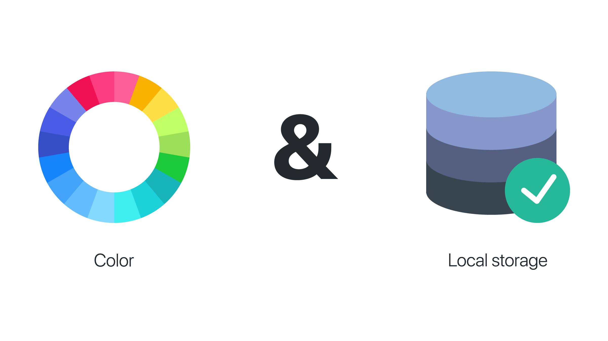
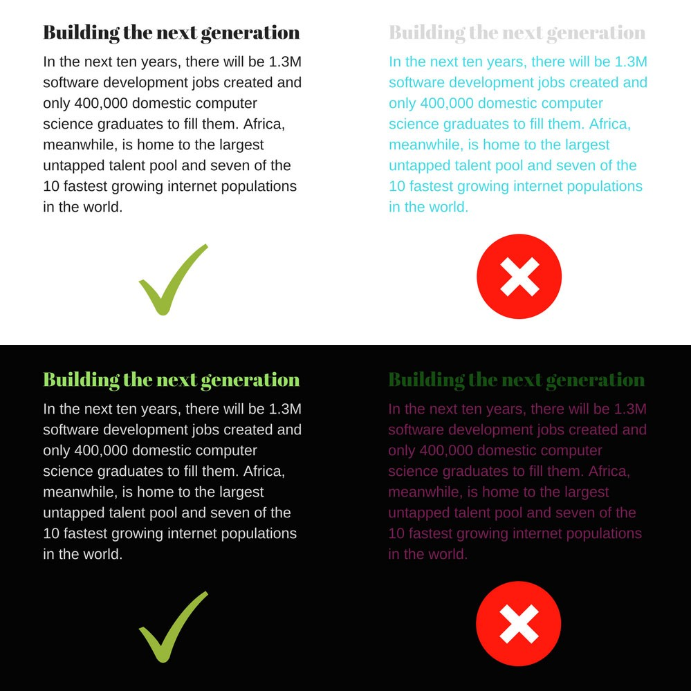
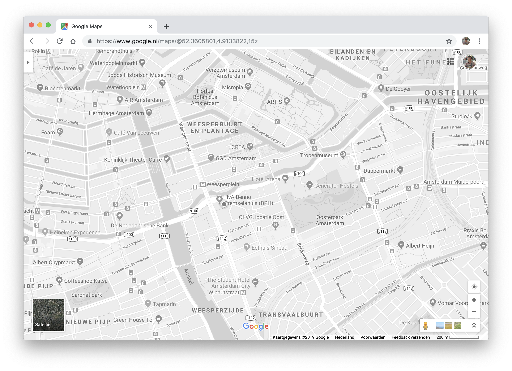
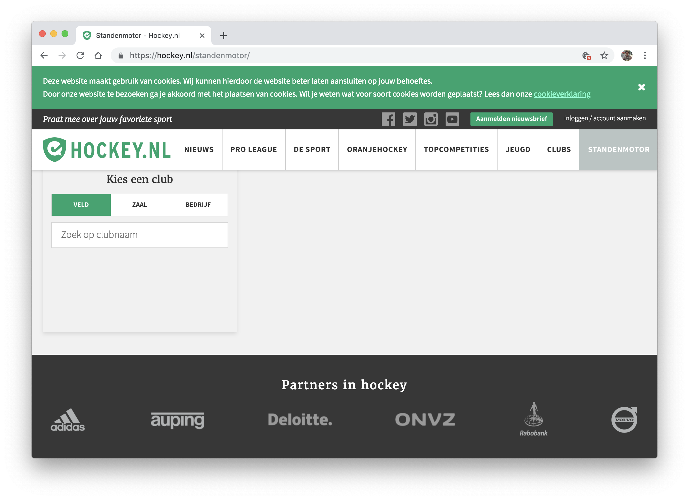
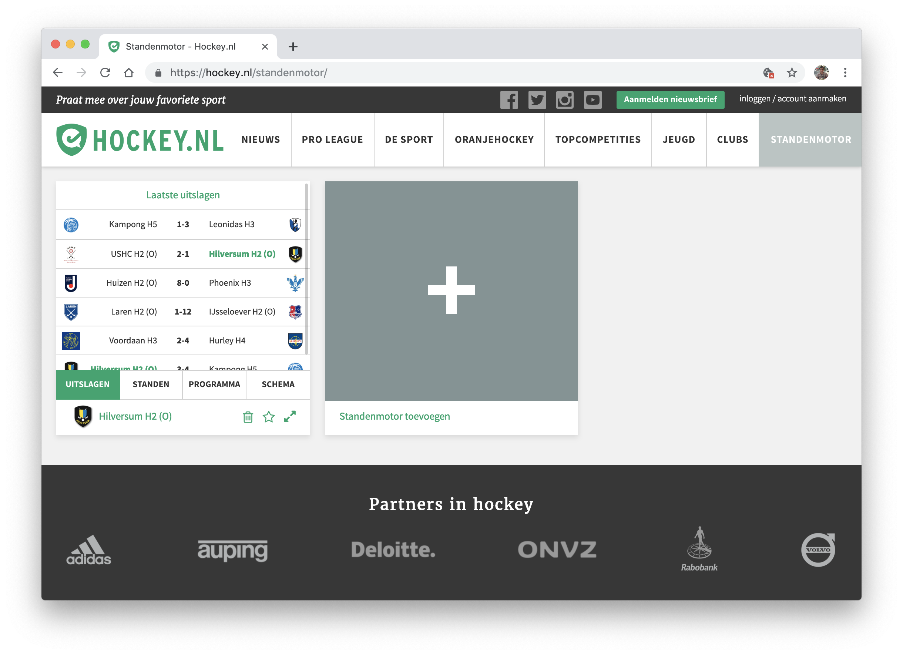

<p align="center">
	<h1 align="center">Browser Technologies</h1>
	
</p>
<p align="center" width="480">
	For this assignment I've done some research about two features of the web; colour and local storage. Below you can find the results of this research.
</p>
<br>

## Table of contents

- [Colour](#Colour)
- [Local storage](#local-storage)
- [Sources](#sources)

## Colour

Colour is one of the most important features on the web. It can make or break a website, doesn't matter what kind of user you are trying to reach.
However, colour is also one of the most difficult features of the web; look at the example below.

<details><summary><a>Contrast</a>
</summary>
<br>

<br>
<blockquote>https://medium.com/@phabbs/dont-suck-at-design-b506abd99f2</blockquote>
</details>

People with vision problems does have a lot of trouble if a website doesn't have a good colour scheme.
But what happens if you only have a greyscale on a website? If the colours are turned off? How does it function?

What I did to test this, I added a few lines of CSS to the universal selector of the stylesheet.

```CSS
* {
  -moz-filter: grayscale(100%);
  -webkit-filter: grayscale(100%);
  filter: grayscale(100%);
}
```

### Examples

For Google Maps colours are very important. The whole map is based on standard colours to highlight different parts. When you 'turn off' the colours and everything is based on a greyscale, the map becomes totally different. All the different aspects look the same and it is not possible to see any difference.

<details><summary><a>Google Maps</a>
</summary>
<br>

<br>
<blockquote>https://www.google.nl/maps</blockquote>
</details>

---

However, for NOS (dutch news website) is it not a problem at all if they do not have any colours. The main goal for the user is to read news articles and with only black and white there is no problem at all.

<details><summary><a>NOS</a>
</summary>
<br>

<br>
<blockquote>https://nos.nl/</blockquote>
</details>

---

Concluding, the goal of the website is really important. If the website needs different colours like Google Maps, it is necessary to determine the right colours. Websites like NOS use it's colours mostly for branding, so the only question they need to ask, is the contrast good enough.

## Local storage

In the backend of a website happens a lot. So many

<details><summary><a>Hockey.nl</a>
</summary>
<br>


<br>
<blockquote>https://nos.nl/</blockquote>
</details>

### Examples

## Sources

- [FlatIcon](https://www.flaticon.com)
- [Google Maps](https://www.google.nl/maps)
- [NOS](https://nos.nl/)
